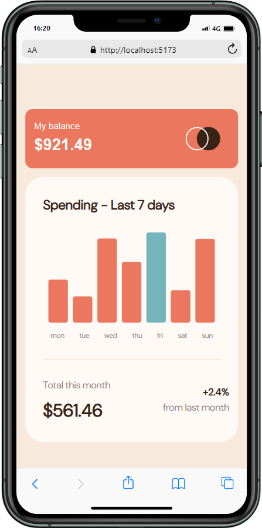

# Frontend Mentor - Expenses chart component solution

This is a solution to the [Expenses chart component challenge on Frontend Mentor](https://www.frontendmentor.io/challenges/expenses-chart-component-e7yJBUdjwt). Frontend Mentor challenges help you improve your coding skills by building realistic projects. 

## Table of contents

- [Frontend Mentor - Expenses chart component solution](#frontend-mentor---expenses-chart-component-solution)
  - [Table of contents](#table-of-contents)
  - [Overview](#overview)
    - [The challenge](#the-challenge)
  - [Screenshot](#screenshot)
    - [Mobile view](#mobile-view)
    - [Ipad View](#ipad-view)
    - [Desktop View](#desktop-view)
    - [Links](#links)
  - [My process](#my-process)
    - [Built with](#built-with)
    - [What I learned](#what-i-learned)
  - [Author](#author)

**Note: Delete this note and update the table of contents based on what sections you keep.**

## Overview

### The challenge

Users should be able to:

- View the bar chart and hover over the individual bars to see the correct amounts for each day
- See the current day’s bar highlighted in a different colour to the other bars
- View the optimal layout for the content depending on their device’s screen size
- See hover states for all interactive elements on the page
- **Bonus**: Use the JSON data file provided to dynamically size the bars on the chart

## Screenshot

### Mobile view




### Ipad View

.png)

### Desktop View

.png)

### Links


## My process

I broke it down to create different component so every feature stays indepedant and clean. 
The main piece was of course the chart component. I used recharts to help me with it. 
First, I put all elements as raw data, then I made it dynamic using the JSON file data.


### Built with

- Semantic HTML5 markup
- SCSS
- Flexbox
- Mobile-first workflow
- Javascript
- [React](https://reactjs.org/) - JS library
- [Recharts](https://recharts.org/) - A composable charting library built on React components

### What I learned

I learned how to use recharts library and it's bar chart component:

```js
<BarChart width="100%" height="100%" data={Data} >
        <XAxis dataKey="day" hide={true}/>
        <Tooltip />
        <Bar dataKey="amount" shape={RoundedBar}>
          {Data.map((entry, index) => (
            <Cell
              key={`cell-${index}`}
              fill={entry.amount === maxValue ? 'hsl(186, 34%, 60%)' : 'hsl(10, 79%, 65%)'}
            />
          ))}
        </Bar>
    </BarChart>
```

## Author

- Frontend Mentor - [@SanchezCamille](https://www.frontendmentor.io/profile/SanchezCamille)
